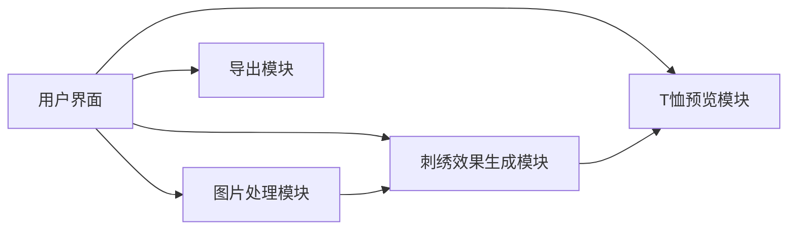

## 1. Architecture Design

## 2. Technology Description
- **Frontend**: React@18 + TypeScript + tailwindcss@3 + Vite
- **初始化工具**: vite-init
- **后端**: None
- **图像处理**: Canvas API
- **状态管理**: 简单的 useState 和 useRef（无额外库）

## 3. Route Definitions
| Route | Purpose |
|-------|---------|
| / | 主设计页面 |

## 4. API Definitions (if backend exists)
不适用

## 5. Server Architecture Diagram (if backend exists)
不适用

## 6. Data Model (if applicable)
不适用
