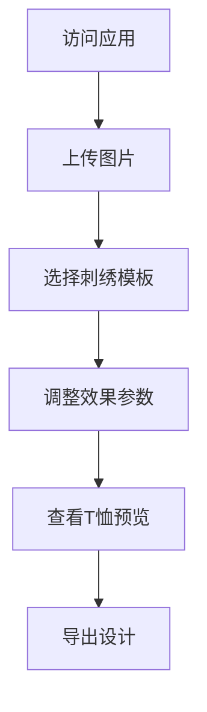

## 1. Product Overview
这是一个图片刺绣T恤设计工具，允许用户上传图片并将其转换为刺绣效果，然后在T恤模型上预览设计，最后导出结果。
- 主要用途：为T恤设计刺绣图案，适用于创意设计师和DIY爱好者
- 目标用户：创意设计师、DIY爱好者、小型服装定制业务

## 2. Core Features

### 2.1 User Roles (if applicable)
本产品无需区分用户角色，所有用户拥有相同的功能权限。

### 2.2 Feature Module
1. **主设计页面**：图片上传、刺绣效果处理、T恤预览、模板选择、导出功能

### 2.3 Page Details
| Page Name | Module Name | Feature description |
|-----------|-------------|---------------------|
| 主设计页面 | 图片上传模块 | 支持拖拽或点击上传图片，支持常见图片格式 |
| 主设计页面 | 刺绣效果处理 | 将图片转换为刺绣纹理效果，支持参数调整 |
| 主设计页面 | T恤可视化 | 将刺绣效果叠加在T恤模型上，支持选择T恤颜色 |
| 主设计页面 | 刺绣模板选择 | 提供多种刺绣风格模板供用户选择 |
| 主设计页面 | 导出功能 | 导出设计结果为图片文件 |

## 3. Core Process
用户访问应用 → 上传图片 → 选择刺绣模板 → 调整参数 → 查看T恤预览 → 导出设计

## 4. User Interface Design

### 4.1 Design Style
- **主色调**：深蓝色（#1e3a8a）和金色（#f59e0b），营造专业又创意的氛围
- **按钮风格**：圆角矩形，带有微妙的阴影和悬停效果
- **字体**：使用优雅的 serif 字体作为标题，清晰的 sans-serif 作为正文
- **布局风格**：卡片式布局，左右分栏设计
- **图标风格**：简约、现代的线性图标

### 4.2 Page Design Overview
| Page Name | Module Name | UI Elements |
|-----------|-------------|-------------|
| 主设计页面 | 整体布局 | 深蓝色背景，金色点缀，响应式设计 |
| 主设计页面 | 图片上传区 | 大的拖拽区域，带有提示文字和图标 |
| 主设计页面 | 效果控制区 | 滑块控件、下拉选择器、颜色选择器 |
| 主设计页面 | 预览区 | T恤模型展示，刺绣效果叠加 |
| 主设计页面 | 导出区 | 突出的导出按钮，支持多种格式 |

### 4.3 Responsiveness
桌面端为主，同时支持平板和移动端自适应布局

### 4.4 3D Scene Guidance (if applicable)
不适用
